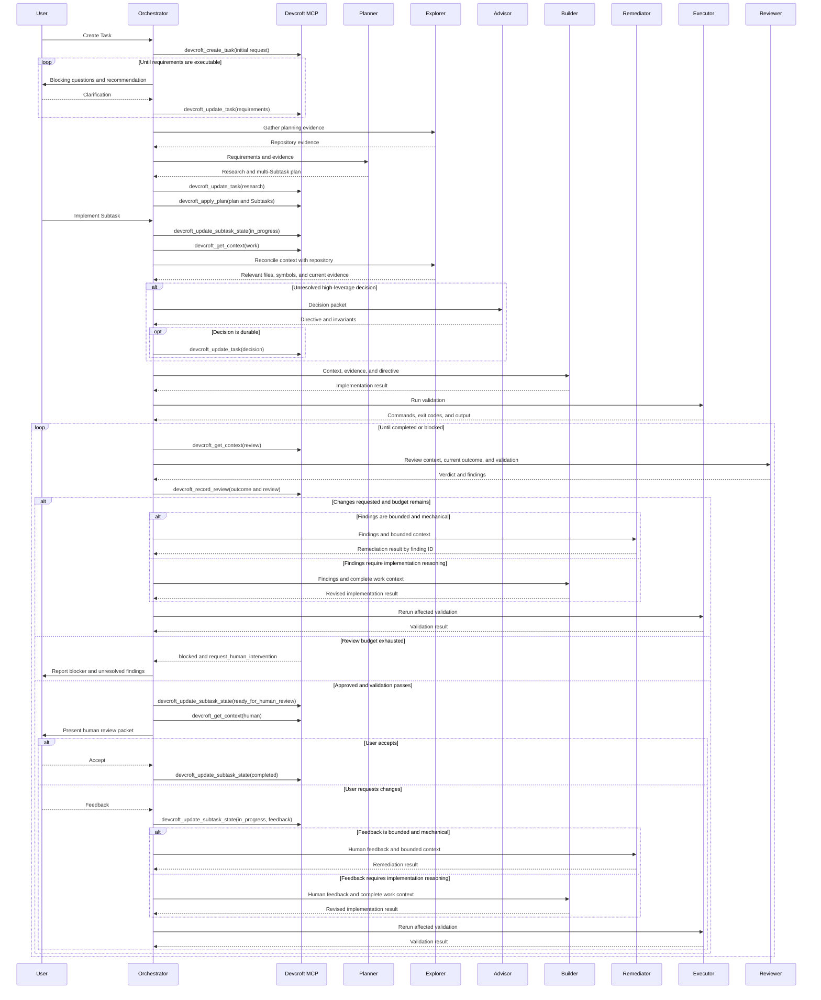

# Devcroft Development Workflow

## Status

This document records the intended OpenCode workflow that will replace the current `taskctl`-based workflow. It is a design reference rather than a description of the current configuration.

## Goals

- Use Sol only where its reasoning quality materially improves the result.
- Plan an entire Task as multiple independently reviewable Subtasks.
- Keep lifecycle state and durable workflow records behind a small MCP interface.
- Make Orchestrator the only agent with access to the Devcroft MCP.
- Keep specialist agents stateless and supply them with explicit context and output contracts.
- Give each agent a semantic role, role-specific instructions, and the narrowest permissions it needs.
- Return compact scope-specific context and explicit next actions instead of complete Task history.
- Bound automated remediation so persistent disagreement returns to the user rather than looping indefinitely.

## Terminology

- **Task:** The complete user objective, requirements, research, plan, and durable architectural decisions.
- **Subtask:** An independently implementable and reviewable portion of a Task. A Subtask will normally correspond to one source-control PR, but the workflow does not model the external PR directly.
- **Agent:** A semantic workflow role with a selected model, reasoning variant, instructions, and permission envelope.

`Subtask` is preferred over `Step` because Subtasks can have dependencies without implying that every item is a strictly sequential operation.

## Ownership

### Orchestrator

Orchestrator is the workflow control plane and sole Devcroft MCP client. It owns:

- User clarification and acceptance.
- Task and Subtask lifecycle transitions.
- Model and role selection.
- Sol usage and escalation decisions.
- Complete specialist handoffs.
- Persistence of research, plans, durable advisor decisions, and reviews.
- Reporting workflow state, validation, findings, and blockers to the user.

### Specialists

Planner, Explorer, Advisor, Builder, Remediator, Reviewer, Expert Reviewer, and Executor never mutate workflow state or call the Devcroft MCP. Each specialist receives a complete bounded context packet and returns a structured result to Orchestrator.

Specialists should not delegate to one another. In particular, Builder returns an `advisor_required` result when it encounters an unresolved architectural decision; Orchestrator decides whether to invoke Advisor.

## Agents

Agent names describe their semantic workflow responsibilities. This keeps routing, prompts, permissions, and reports understandable without requiring the caller to reinterpret a model-oriented name on every invocation.

| Agent | Model and variant | Permissions | Responsibility |
| --- | --- | --- | --- |
| `orchestrator` | DeepSeek v4 Pro high | Devcroft MCP, user interaction, and specialist dispatch | Own the workflow, lifecycle, context handoffs, and escalation decisions. |
| `planner` | GPT-5.6 Sol xhigh | Read-only repository inspection | Research and decompose a complete Task into reviewable Subtasks. |
| `explorer` | DeepSeek v4 Flash max | Read-only repository inspection | Retrieve bounded repository evidence without making implementation decisions. |
| `advisor` | GPT-5.6 Sol high | Read-only repository inspection | Resolve one precise, high-leverage implementation decision. |
| `builder` | GPT-5.6 Terra high | Repository editing and validation delegation | Implement or remediate one bounded Subtask. |
| `remediator` | GPT-5.6 Luna high | Repository editing within supplied finding scope | Address bounded, concrete review findings without reopening implementation design. |
| `reviewer` | DeepSeek v4 Pro max | Read-only repository inspection | Perform the default independent review. |
| `expert-reviewer` | GPT-5.6 Sol high | Read-only repository inspection | Perform risk-triggered or explicitly requested expert review. |
| `executor` | GPT-5.6 Luna medium | Exact command execution only | Run tests, builds, and other bounded validation commands. |

`builder` is preferred over `worker` because its responsibility is specifically implementation and remediation rather than arbitrary background work. Semantic agents may use shared prompt fragments and skills, but each agent retains a role-specific prompt and least-privilege permission set.

## Planning

Sol xhigh is the dedicated Planner. Planning is expected to occur only once or twice per day and covers the complete Task decomposition, making this a deliberate use of the strongest reasoning tier.

Before invoking Planner, Orchestrator should use Explorer to gather relevant repository evidence. Planner receives clarified requirements and that evidence in one complete handoff and should normally return research and the multi-Subtask plan together.

Planner does not question the user directly. If requirements remain blocked, Planner returns the smallest set of blocking questions to Orchestrator. Orchestrator asks the user and resumes the same planning workstream with the answers.

The initial plan is ordered. Once implementation starts, Planner may revise only the pending Subtask suffix. The active Subtask and completed Subtasks remain immutable, while pending Subtasks may be added, removed, reordered, or replaced. `devcroft_apply_plan` validates this rule without requiring a separate replanning tool.

## Advisor

Advisor is invoked proactively when an unresolved decision is likely to benefit code architecture, correctness, or long-term maintainability. An Advisor invocation must have a precise decision question rather than a general request to improve the implementation.

### Advisor triggers

Invoke Advisor when a decision involves one or more of:

- Module ownership or placement of a new seam.
- Multiple plausible approaches with material maintenance trade-offs.
- Public interfaces or backward compatibility.
- Authentication, authorization, privacy, or trust.
- Persistence, migrations, or data integrity.
- Concurrency, retries, idempotency, or distributed behavior.
- A pattern likely to be repeated by later Subtasks.
- A choice that would be expensive to reverse.

Do not invoke Advisor when Planner already resolved the decision or the repository has an unambiguous established pattern. Builder may identify a new decision during implementation, but it returns an `advisor_required` packet rather than invoking Advisor itself.

### Durable advisor decisions

Persist an advisor decision when it affects multiple Subtasks, establishes an invariant future work must preserve, changes or supplements the plan, selects between meaningful architectural alternatives, or is likely to be reconsidered later.

Do not persist local implementation advice that is evident from the resulting code and has no effect outside the current Subtask.

A durable decision contains:

- Decision question.
- Selected decision.
- Concise rationale.
- Required invariants.
- Affected Subtasks.
- A rejected alternative when the distinction remains relevant.

Durable advisor decisions are appended to the Task through `devcroft_update_task` and become active immediately. Builder- or Remediator-reported implementation decisions and deviations become active cross-Subtask context only after the user accepts that Subtask. Unaccepted implementation outcomes must not constrain later work.

## Implementation

Terra high is the Builder. High-risk implementation should first be bounded through planning or an Advisor directive rather than switching the Builder role to a broadly privileged Sol agent.

Before dispatching Builder, Orchestrator obtains the Subtask context and asks Explorer to reconcile it with the current repository. This is a focused freshness check and relevant-file discovery pass, not a repetition of the original Task research.

Builder receives requirements, plan context, repository evidence, applicable advisor directives, scope limits, and validation expectations. It returns changed files, implementation summary, requested validation, residual risks, any blocker or advisor request, durable implementation decisions, deviations from the plan, and `future_impact: none|context_only|replan_required`.

When an accepted outcome has `future_impact: replan_required`, the next pending Subtask cannot start until Planner revises the pending suffix or confirms it remains valid through `devcroft_apply_plan`.

Executor runs exact validation commands after implementation and after remediation. It returns commands, exit codes, and relevant output without making architectural or lifecycle decisions.

## Review

DeepSeek v4 Pro max is the default Reviewer. Sol high is the Expert Reviewer.

Expert review replaces the default review when high risk is known before review. It is not automatically stacked after a complete default review. Escalate to Expert Reviewer when:

- Security, authorization, concurrency, migration, compatibility, or data-integrity behavior is involved.
- The implementation introduces an important new module seam or public interface.
- A default-review finding is disputed or uncertain.
- The default Reviewer reports insufficient confidence.
- The user explicitly requests expert review.

Review receives the requirements, Subtask context, agreed diff scope, changed files, and validation results. Reviews are not bound to a stored code revision. As a workflow convention, Orchestrator requests another review after material remediation.

The remediation loop continues until there are no blocking findings, not until there are no suggestions. Automatic review permits at most three consecutive `changes_requested` verdicts before requiring human intervention.

Each finding should include a stable ID, severity, blocking status, evidence, rationale, and remediation guidance. Orchestrator records both approval and actionable findings through the MCP.

### Remediation routing

Review guidance is evidence and direction, not an automatically trusted patch specification. Orchestrator dispatches Remediator when all blocking findings are concrete, localized, low risk, and do not require a new architectural or behavioral decision. Examples include a missed guard, a localized error path, a test correction, a small compatibility fix with explicit expected behavior, or mechanical cleanup directly required by a finding.

Orchestrator returns the work to Builder when a finding changes architecture, public behavior, persistence, authorization, concurrency, or broad implementation structure; spans several modules; is unclear or disputed; requires an Advisor decision; or follows a failed remediation attempt. Findings from Expert Reviewer use Builder unless they are explicitly classified as mechanical.

Remediator receives the current findings, relevant context, affected files, scope limits, and validation expectations. It must map each change to finding IDs and return unresolved findings rather than widening scope. Executor validates every remediation. Default Reviewer verifies the result unless an unresolved finding still meets the expert-review triggers, in which case Expert Reviewer verifies it.

Automated review allows at most three consecutive `changes_requested` verdicts. `devcroft_record_review` tracks the attempt count and moves the Subtask to `blocked` when the budget is exhausted. Approval resets the count; human-requested changes begin a new bounded automated-review cycle. Further work after exhaustion requires user intervention.

Automated approval and human acceptance remain separate. If the user requests changes during human review, Orchestrator records the feedback, returns the Subtask to `in_progress`, dispatches Remediator or Builder using the same routing rules, reruns validation, and requires another automated review before requesting human acceptance again.

## Devcroft MCP Interface

The MCP server is named `devcroft`. Its internal tool names omit the prefix because OpenCode registers MCP tools using the server name as a prefix.

The MCP is a persistence and workflow-validation module. It stores canonical records, validates legal transitions, produces bounded context, and reports allowed next actions. It does not question the user, perform research or planning, dispatch agents, edit source code, execute validation, review changes, manage source branches, or infer human intent.

| Internal tool | OpenCode tool | Responsibility |
| --- | --- | --- |
| `create_task` | `devcroft_create_task` | Create a draft Task from the initial request. |
| `get_context` | `devcroft_get_context` | Return bounded Task or Subtask context for a requested scope. |
| `update_task` | `devcroft_update_task` | Update clarified requirements, research, or durable decisions. |
| `apply_plan` | `devcroft_apply_plan` | Establish the initial ordered plan or atomically revise only its pending Subtask suffix. |
| `update_subtask_state` | `devcroft_update_subtask_state` | Start, block, submit for human review, return for human feedback, reopen, or complete a Subtask. |
| `record_review` | `devcroft_record_review` | Store the reviewed implementation outcome, standard or expert verdict, and findings; track attempts; and enforce the remediation budget. |

The MCP implementation validates legal state transitions even though they share one `update_subtask_state` tool. Separate `start_subtask` and `accept_subtask` tools are unnecessary.

Every mutation explicitly names its Task and, when applicable, its Subtask. The server returns an ambiguity error rather than guessing a target, and it does not persist a globally selected Task.

### Context projections

`devcroft_get_context` returns deterministic scope-specific projections rather than complete Task history:

| Scope | Contents |
| --- | --- |
| `summary` | Task state, compact Subtask progress, blockers, allowed actions, and next action. |
| `planning` | Requirements, research, active durable decisions, accepted Subtask outcomes, and the pending plan suffix. |
| `work` | Current Subtask contract, relevant requirements and research, applicable decisions, accepted dependency outcomes, current feedback, and validation expectations. |
| `review` | Current Subtask contract, latest recorded implementation outcome, validation, residual risks, applicable feedback, and prior findings needed for review. The caller supplies the current unrecorded implementation result. |
| `human` | Human-facing approval packet containing the implementation summary, automated approval, validation, decisions, deviations, residual risks, and allowed decisions. |

Mandatory context is never silently truncated. An over-broad request returns `context_too_large`; history pagination and semantic retrieval are deferred until an observed need justifies them.

Mutation responses remain compact and return the resulting state, changed record IDs, `allowed_actions`, and `next_action`. Callers request a fresh context projection only when the next phase needs it.

### Error contract

Workflow failures use a small stable vocabulary:

```text
not_found
invalid_argument
invalid_state
ambiguous_context
context_too_large
review_budget_exhausted
internal
```

Every error returns a safe message, whether it is retryable, and a permitted next action such as `refresh_context`, `reduce_context_scope`, `request_human_intervention`, or `revise_future_plan`.

### Storage guarantees

Canonical records include a schema version and are decoded strictly. The implementation validates changes in memory, serializes deterministically, and performs atomic temporary-file replacement under a local mutation lock. Unknown schema versions and invalid transitions are rejected before writing.

The store does not contain chat transcripts, full source diffs, raw command output, absolute source paths, environment values, credentials, or secrets. Task revisions, Git synchronization, source commit binding, and persisted idempotency receipts are deferred until demonstrated workflow needs justify them.

### MCP permissions

The Devcroft MCP is denied globally and enabled only for Orchestrator:

```json
{
  "permission": {
    "devcroft_*": "deny"
  },
  "agent": {
    "orchestrator": {
      "permission": {
        "devcroft_*": "allow"
      }
    }
  }
}
```

These permissions control OpenCode tool access. The MCP implementation should not expose an alternate state-mutating CLI or directly writable state store to specialist agents.

## State Model

Subtasks use the following states:

```text
pending
in_progress
ready_for_human_review
blocked
completed
```

Agent review remains an activity rather than a persistent lifecycle state. Task status should be derived from its plan and Subtask states where practical, avoiding duplicate state that can become inconsistent.

Subtasks are ordered, and only the first eligible pending Subtask may enter `in_progress`. Starting a Subtask freezes its contract. Human feedback and review findings guide revisions without silently replacing that contract.

`ready_for_human_review` requires current automated approval and validation. Human acceptance moves the Subtask directly to `completed`; human changes return it to `in_progress`. Completing a Subtask activates its accepted implementation decisions and deviations. If its future impact requires replanning, the next Subtask remains ineligible until the pending plan suffix is revised or confirmed.

## Workflow



## Migration Notes

Replacing `taskctl` requires more than adding the MCP server. The current Orchestrator, Planner, workflow, review, command, and skill instructions contain `taskctl` ownership and artifact rules that must be removed or rewritten.

The migration should also:

- Remove the workflow subagent used only for bounded `taskctl` execution.
- Prevent Planner and review agents from writing lifecycle artifacts directly.
- Give each semantic agent a role-specific prompt, shared prompt fragments where useful, and least-privilege permissions.
- Route every specialist invocation through Orchestrator.
- Deny `devcroft_*` globally and allow it only for Orchestrator.
- Keep the existing workflow operational until the Devcroft MCP interface and replacement prompts are ready.
