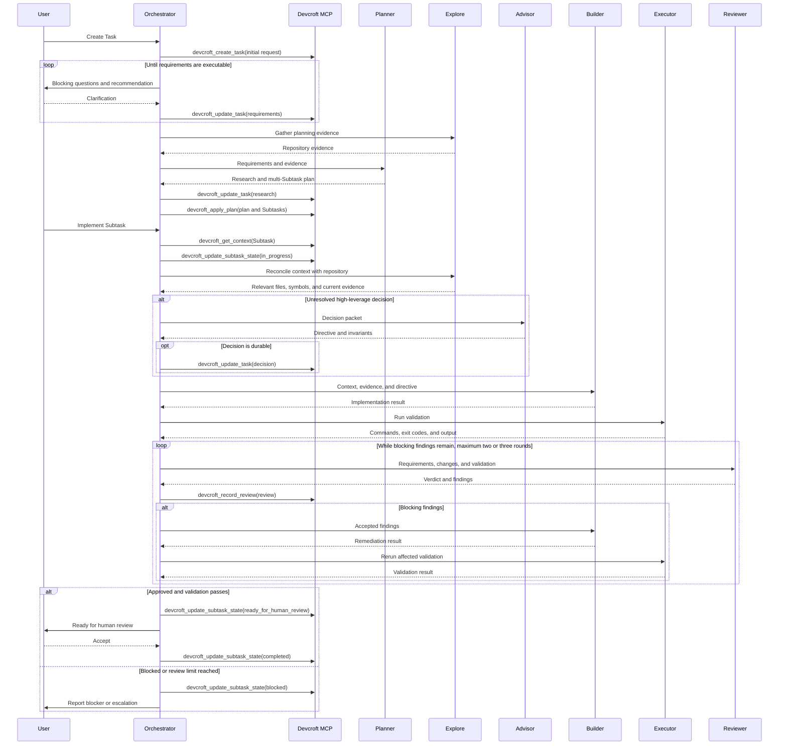

# Devcroft Development Workflow

## Status

This document records the intended OpenCode workflow that will replace the current `taskctl`-based workflow. It is a design reference rather than a description of the current configuration.

## Goals

- Use Sol only where its reasoning quality materially improves the result.
- Plan an entire Task as multiple independently reviewable Subtasks.
- Keep lifecycle state and durable workflow records behind a small MCP interface.
- Make Orchestrator the only agent with access to the Devcroft MCP.
- Keep specialist agents stateless and supply them with explicit context and output contracts.
- Prefer reusable model-capability agents over agents permanently tied to one role.

## Terminology

- **Task:** The complete user objective, requirements, research, plan, and durable architectural decisions.
- **Subtask:** An independently implementable and reviewable portion of a Task. A Subtask will normally correspond to one source-control PR, but the workflow does not model the external PR directly.
- **Role:** The temporary responsibility assigned to an agent invocation, such as Planner, Advisor, Builder, or Expert Reviewer.
- **Agent profile:** A reusable model, reasoning variant, and permission envelope. Role-specific instructions are supplied at invocation time through a skill or explicit contract.

`Subtask` is preferred over `Step` because Subtasks can have dependencies without implying that every item is a strictly sequential operation.

## Ownership

### Orchestrator

Orchestrator is the workflow control plane and sole Devcroft MCP client. It owns:

- User clarification and acceptance.
- Task and Subtask lifecycle transitions.
- Model and role selection.
- Sol usage and escalation decisions.
- Complete specialist handoffs.
- Persistence of research, plans, durable advisor decisions, and reviews.
- Reporting workflow state, validation, findings, and blockers to the user.

### Specialists

Planner, Explore, Advisor, Builder, Reviewer, and Executor never mutate workflow state or call the Devcroft MCP. Each specialist receives a complete bounded context packet and returns a structured result to Orchestrator.

Specialists should not delegate to one another. In particular, Builder returns an `advisor_required` result when it encounters an unresolved architectural decision; Orchestrator decides whether to invoke Advisor.

## Agent Profiles

Agent names represent reusable model and capability profiles. A single profile may serve multiple roles only when those roles share a compatible permission envelope.

| Agent profile | Permissions | Intended roles |
| --- | --- | --- |
| `sol-xhigh` | Read-only repository inspection | Planner |
| `sol-high` | Read-only repository inspection | Advisor, Expert Reviewer |
| `sol-high-write` | Repository editing and validation | High-risk Builder |
| `ds4-pro-max` | Read-only repository inspection | Default Reviewer |
| `ds4-flash-max` | Read-only repository inspection | Explore |
| `terra-high-write` | Repository editing and validation | Default Builder |
| `luna-medium-exec` | Exact command execution only | Executor |

The read-only `sol-high` profile must not be reused as a Builder. Giving one profile enough permissions for implementation would leave Advisor and Expert Reviewer protected only by prompting rather than enforced permissions.

Role behavior should live in role skills or explicit invocation contracts. For example, Orchestrator may invoke `sol-high` with either the Advisor contract or the code-review skill.

## Planning

Sol xhigh is the dedicated Planner. Planning is expected to occur only once or twice per day and covers the complete Task decomposition, making this a deliberate use of the strongest reasoning tier.

Before invoking Planner, Orchestrator should use Explore to gather relevant repository evidence. Planner receives clarified requirements and that evidence in one complete handoff and should normally return research and the multi-Subtask plan together.

Planner does not question the user directly. If requirements remain blocked, Planner returns the smallest set of blocking questions to Orchestrator. Orchestrator asks the user and resumes the same planning workstream with the answers.

## Advisor

Advisor is invoked proactively when an unresolved decision is likely to benefit code architecture, correctness, or long-term maintainability. An Advisor invocation must have a precise decision question rather than a general request to improve the implementation.

### Advisor triggers

Invoke Advisor when a decision involves one or more of:

- Module ownership or placement of a new seam.
- Multiple plausible approaches with material maintenance trade-offs.
- Public interfaces or backward compatibility.
- Authentication, authorization, privacy, or trust.
- Persistence, migrations, or data integrity.
- Concurrency, retries, idempotency, or distributed behavior.
- A pattern likely to be repeated by later Subtasks.
- A choice that would be expensive to reverse.

Do not invoke Advisor when Planner already resolved the decision or the repository has an unambiguous established pattern. Builder may identify a new decision during implementation, but it returns an `advisor_required` packet rather than invoking Advisor itself.

### Durable advisor decisions

Persist an advisor decision when it affects multiple Subtasks, establishes an invariant future work must preserve, changes or supplements the plan, selects between meaningful architectural alternatives, or is likely to be reconsidered later.

Do not persist local implementation advice that is evident from the resulting code and has no effect outside the current Subtask.

A durable decision contains:

- Decision question.
- Selected decision.
- Concise rationale.
- Required invariants.
- Affected Subtasks.
- A rejected alternative when the distinction remains relevant.

Durable decisions are appended to the Task through `devcroft_update_task`; they do not require a dedicated MCP tool.

## Implementation

Terra high is the default Builder. Sol high with write permissions is reserved for implementation that cannot be made safe and bounded through planning or an Advisor directive.

Before dispatching Builder, Orchestrator obtains the Subtask context and asks Explore to reconcile it with the current repository. This is a focused freshness check and relevant-file discovery pass, not a repetition of the original Task research.

Builder receives requirements, plan context, repository evidence, applicable advisor directives, scope limits, and validation expectations. It returns changed files, implementation summary, requested validation, residual risks, and any blocker or advisor request.

Executor runs exact validation commands after implementation and after remediation. It returns commands, exit codes, and relevant output without making architectural or lifecycle decisions.

## Review

DeepSeek v4 Pro max is the default Reviewer. Sol high is the Expert Reviewer.

Expert review replaces the default review when high risk is known before review. It is not automatically stacked after a complete default review. Escalate to Expert Reviewer when:

- Security, authorization, concurrency, migration, compatibility, or data-integrity behavior is involved.
- The implementation introduces an important new module seam or public interface.
- A default-review finding is disputed or uncertain.
- The default Reviewer reports insufficient confidence.
- The user explicitly requests expert review.

Review receives the requirements, Subtask context, agreed diff scope, changed files, and validation results. Reviews are not bound to a stored code revision. As a workflow convention, Orchestrator requests another review after material remediation.

The remediation loop continues until there are no blocking findings, not until there are no suggestions. Orchestrator should cap automatic review and remediation at two or three rounds, then report or escalate persistent disagreement instead of allowing an unbounded loop.

Each finding should include a stable ID, severity, blocking status, evidence, rationale, and remediation guidance. Orchestrator records both approval and actionable findings through the MCP.

## Devcroft MCP Interface

The MCP server is named `devcroft`. Its internal tool names omit the prefix because OpenCode registers MCP tools using the server name as a prefix.

| Internal tool | OpenCode tool | Responsibility |
| --- | --- | --- |
| `create_task` | `devcroft_create_task` | Create a draft Task from the initial request. |
| `get_context` | `devcroft_get_context` | Return the selected Task or Subtask context. |
| `update_task` | `devcroft_update_task` | Update clarified requirements, research, or durable decisions. |
| `apply_plan` | `devcroft_apply_plan` | Save the plan and atomically establish its Subtasks. |
| `update_subtask_state` | `devcroft_update_subtask_state` | Start, block, submit for human review, reopen, or complete a Subtask. |
| `record_review` | `devcroft_record_review` | Store a standard or expert review verdict and findings. |

The MCP implementation validates legal state transitions even though they share one `update_subtask_state` tool. Separate `start_subtask` and `accept_subtask` tools are unnecessary.

### MCP permissions

The Devcroft MCP is denied globally and enabled only for Orchestrator:

```json
{
  "permission": {
    "devcroft_*": "deny"
  },
  "agent": {
    "orchestrator": {
      "permission": {
        "devcroft_*": "allow"
      }
    }
  }
}
```

These permissions control OpenCode tool access. The MCP implementation should not expose an alternate state-mutating CLI or directly writable state store to specialist agents.

## State Model

Subtasks use the following states:

```text
pending
in_progress
ready_for_human_review
blocked
completed
```

Agent review remains an activity rather than a persistent lifecycle state. Task status should be derived from its plan and Subtask states where practical, avoiding duplicate state that can become inconsistent.

## Workflow



## Migration Notes

Replacing `taskctl` requires more than adding the MCP server. The current Orchestrator, Planner, workflow, review, command, and skill instructions contain `taskctl` ownership and artifact rules that must be removed or rewritten.

The migration should also:

- Remove the workflow subagent used only for bounded `taskctl` execution.
- Prevent Planner and review agents from writing lifecycle artifacts directly.
- Move role-specific behavior into reusable skills or invocation contracts.
- Route every specialist invocation through Orchestrator.
- Deny `devcroft_*` globally and allow it only for Orchestrator.
- Keep the existing workflow operational until the Devcroft MCP interface and replacement prompts are ready.
